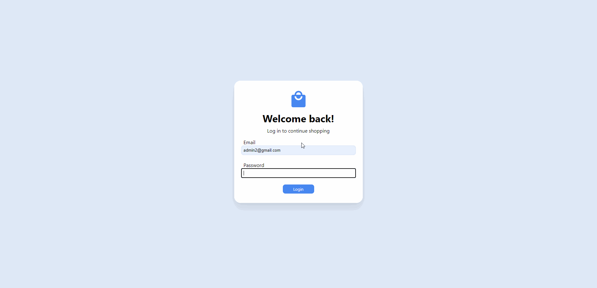

# Shopping Cart UI
Front-End for Shopping Cart API by Tianyuan
<br>

 <br>

### FrontEnd Technologies
  - React.js
  - Material-UI
  - AWS S3 Static Web Hosting
  - Redux State Management
### BackEnd Technologies 
  - AWS EC2 Server Hosting
  - AWS RDS Database Hosting
  - Jenkins CD Pipeline
  - Java Tomcat Servlet API

## Features
The Shopping Cart UI is a website that allows users to add a list of items to their own shopping cart. In v0, the user can:
  - Login/Logout
  - View current list of products
  - Add Products to your shopping cart
  - View products in their current shopping cart
  - Delete Products from your shopping cart
  - Edit their current Password

## Getting started *WARNING: Underlying database has been deactivated from AWS RDS by owner. Functionality for website has consequently been discontinued*
1. Clone repo: 
```git clone https://github.com/tylercodes1/shopping-cart-ui.git```
2. Open in IDE and open terminal. Alternatively, go to root directory and 
```npm install```
3. Run application:
```npm start```

## Usage
- Username: admin2@gmail.com
- Password: 1234

## My Backend Repo
https://github.com/tylercodes1/PartyCity
